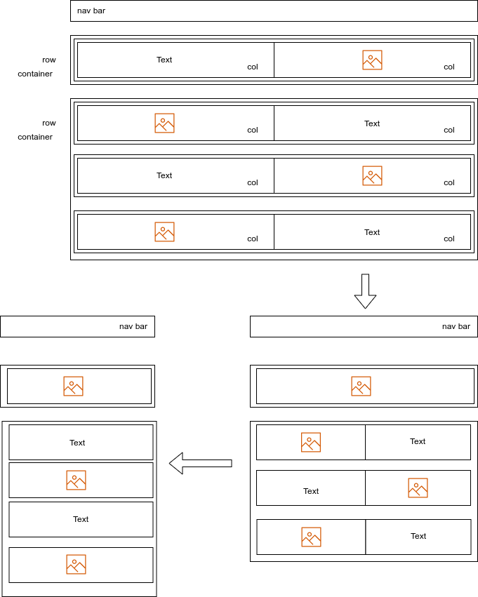

# Museum Of Candy Project

## What have I learnt

### CSS

#### How to use CSS to style?
We can select the target by id and class name
```css
#mainNavbar .nav-link {
    color: white;
}
```

By id and type name
```css
#headingGroup h1 {
    font-weight: 100;
}
```

By class and type name
```css
.blurb h2 {
    font-size: 2rem;
}
```

#### Use media query to control the style based on the document width
```css
@media (max-width: 1200px) {
    #headingGroup h1 {
        font-weight: 100;
        font-size: 3rem;
    }
    .blurb h2 {
        font-size: 2rem;
    }
}
```

### HTML

#### Nav bar
- How to insert a responsive nav bar
- How to toggle class by javascript dynamically so that we can control the style through css

#### Container
- How to use bootstrap and container to get the responsive ability

#### Bootstrap class
- py: pending y axis
- px: pending x axis
- d-none d-lg-block: Always shows none but only visible when document is large

## Web page structure

